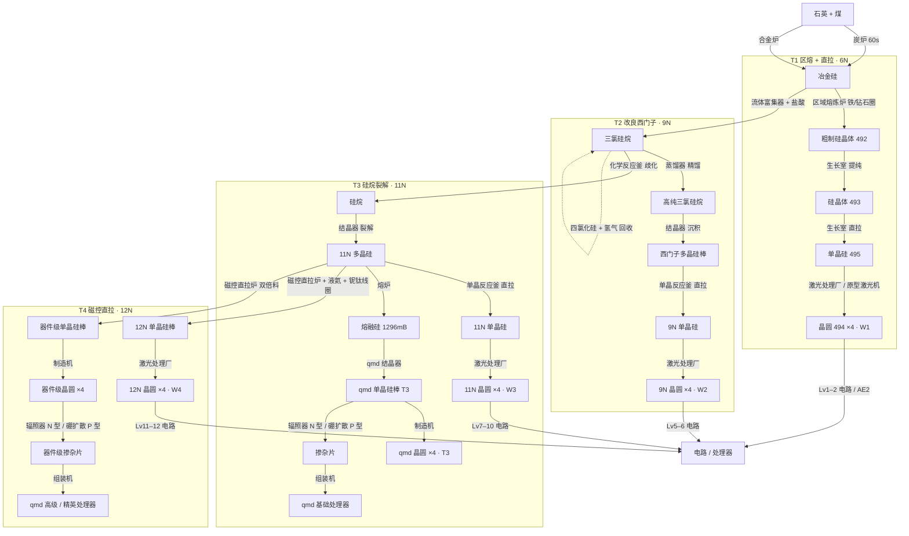

```mermaid
graph TD
    Q1[石英 + 煤] -->|炭炉 60s| MG[冶金硅]
    Q1 -->|合金炉| MG

    subgraph T1[ T1 区熔 + 直拉 · 6N ]
        MG -->|区域熔炼炉 铁/钻石圈| C492[粗制硅晶体 492]
        C492 -->|生长室 提纯| EG[硅晶体 493]
        EG -->|生长室 直拉| IU495[单晶硅 495]
        IU495 -->|激光处理厂 / 原型激光机| IU494[晶圆 494 ×4 · W1]
    end

    subgraph T2[ T2 改良西门子 · 9N ]
        MG -->|流体富集器 + 盐酸| TCS[三氯硅烷]
        TCS -->|蒸馏器 精馏| PTCS[高纯三氯硅烷]
        PTCS -->|结晶器 沉积| SP[西门子多晶硅棒]
        SP -->|单晶反应釜 直拉| M9[9N 单晶硅]
        M9 -->|激光处理厂| W9[9N 晶圆 ×4 · W2]
    end

    subgraph T3[ T3 硅烷裂解 · 11N ]
        TCS -->|化学反应釜 歧化| SI[硅烷]
        TCS -.->|四氯化硅 + 氢气 回收| TCS
        SI -->|结晶器 裂解| P11[11N 多晶硅]
        P11 -->|单晶反应釜 直拉| M11[11N 单晶硅]
        M11 -->|激光处理厂| W11[11N 晶圆 ×4 · W3]
        P11 -->|熔炉| MS[熔融硅 1296mB]
        MS -->|qmd 结晶器| QB[qmd 单晶硅棒 T3]
        QB -->|制造机| QW[qmd 晶圆 ×4 · T3]
        QB -->|辐照器 N 型 / 硼扩散 P 型| QBPD[掺杂片]
        QBPD -->|组装机| QBP[qmd 基础处理器]
    end

    subgraph T4[ T4 磁控直拉 · 12N ]
        P11 -->|磁控直拉炉 + 液氦 + 铌钛线圈| M12[12N 单晶硅棒]
        M12 -->|激光处理厂| W12[12N 晶圆 ×4 · W4]
        P11 -->|磁控直拉炉 双倍料| DB[器件级单晶硅棒]
        DB -->|制造机| DW[器件级晶圆 ×4]
        DW -->|辐照器 N 型 / 硼扩散 P 型| DPD[器件级掺杂片]
        DPD -->|组装机| QAP[qmd 高级 / 精英处理器]
    end

    IU494 -->|Lv1–2 电路 / AE2| CHIP[电路 / 处理器]
    W9 -->|Lv5–6 电路| CHIP
    W11 -->|Lv7–10 电路| CHIP
    W12 -->|Lv11–12 电路| CHIP
```
