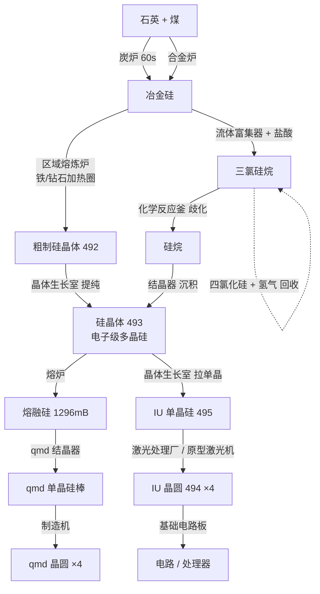

```mermaid
graph TD
    Q1[石英 + 煤] -->|炭炉 60s| MG[冶金硅]
    Q1 -->|合金炉| MG
    MG -->|区域熔炼炉<br/>铁/钻石加热圈| C492[粗制硅晶体 492]
    C492 -->|晶体生长室 提纯| EG[硅晶体 493<br/>电子级多晶硅]
    MG -->|流体富集器 + 盐酸| TCS[三氯硅烷]
    TCS -->|化学反应釜 歧化| SI[硅烷]
    TCS -.->|四氯化硅 + 氢气 回收| TCS
    SI -->|结晶器 沉积| EG
    EG -->|熔炉| MS[熔融硅 1296mB]
    MS -->|qmd 结晶器| QB[qmd 单晶硅棒]
    QB -->|制造机| QW[qmd 晶圆 ×4]
    EG -->|晶体生长室 拉单晶| IU495[IU 单晶硅 495]
    IU495 -->|激光处理厂 / 原型激光机| IU494[IU 晶圆 494 ×4]
    IU494 -->|基础电路板| CHIP[电路 / 处理器]
```